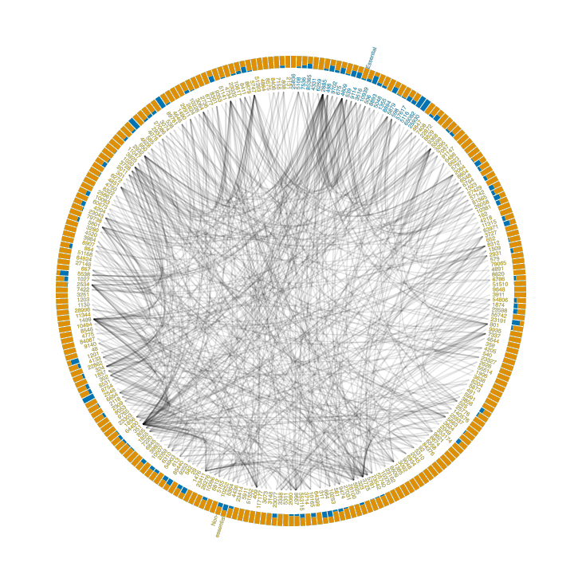
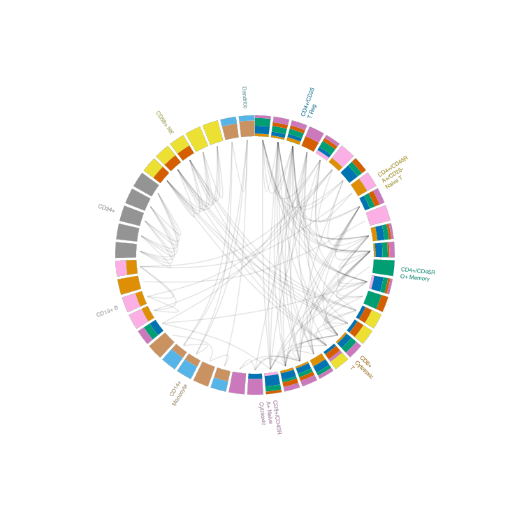
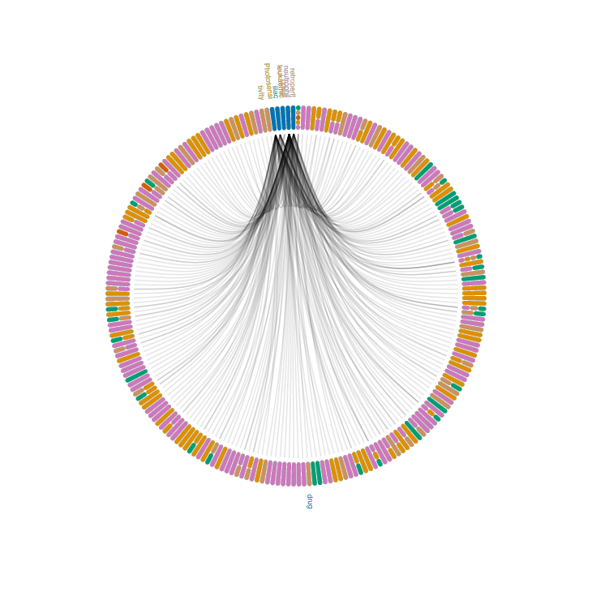
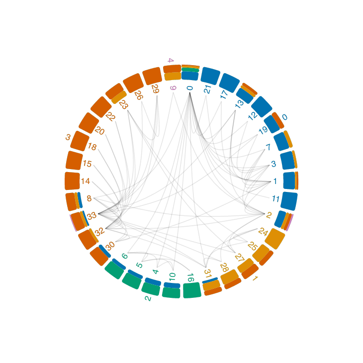

# `parag`<a href="#"></a>

<!-- WARNING: THIS FILE WAS AUTOGENERATED! DO NOT EDIT! -->

**Para** (beyond pairwise) **G**raph: interactive visualization of
higher-order graphs in Python

<!-- [![Contributors][contributors-shield]][contributors-url]
[![Forks][forks-shield]][forks-url]
[![Stargazers][stars-shield]][stars-url] -->
<!-- <a href="">[](https://pypi.org/project/parag)</a> -->

<a href="">[](https://github.com/rraadd88/parag/actions/workflows/build.yml)</a>
<a href="">[](https://github.com/rraadd88/parag/issues)</a>
<a href="">[](https://pepy.tech/project/parag)</a>
<a href="">[](https://github.com/rraadd88/parag/blob/master/LICENSE)</a>
<a href="">[](https://doi.org//zenodo.)</a>

## Install

``` sh
pip install parag
```

## Interpretation as a hypergraph, using proportion of degrees by communities

Proportion of degrees by communities in a pairwise graph helps reveal
how nodes are grouped together and connected within different
communities. This analysis highlights clusters of nodes with strong
internal connections, potentially representing higher-order
relationships. By comparing the degree proportions within and between
communities, we can distinguish internal cohesion from inter-community
interactions. These insights aid in interpreting the graph as a
hypergraph, where communities with high intra-community connections may
signify higher-order relationships, offering a richer understanding of
complex interactions beyond simple pairwise connections.

Inspired by

> Vehlow, Corinna, Thomas Reinhardt, and Daniel Weiskopf. “Visualizing
> fuzzy overlapping communities in networks.” IEEE Transactions on
> Visualization and Computer Graphics 19.12 (2013): 2486-2495.  
> [Figure
> 9B](https://www.researchgate.net/profile/Corinna-Vehlow/publication/256837277/figure/fig4/AS:601696052985880@1520466926646/The-protein-protein-interaction-network-from-Figure-8-shown-with-our-circular-layout-a.png)

Examples:

### Gene interaction networks

``` python
from parag.hypergraph import to_net
cfg,df_=to_net(
    nodes=nodes.sort_values('Essentiality (determined from multiple datasets)'),
    edges=edges,
    col_node_id='Gene ID',
    col_source='# protein1',
    col_target='protein2',
    col_subset_id='Essentiality (determined from multiple datasets)',
    show_node_names=True,
    defaults=dict(
        radius=250,
        innerRadius=280,
        outerRadius=295,
        textSize=7,
        textOffset=3,
    ),
)
```

        <iframe
            width="100%"
            height="1000"
            src="outputs//interactions.html"
            frameborder="0"
            allowfullscreen
            &#10;        ></iframe>
        &#10;
<div>

[](https://rraadd88.github.io/parag#interpretation-as-a-hypergraph-using-proportion-of-degrees-by-communities)

</div>

### Neighbourhood analysis in latent space e.g. single cell data

``` python
sc.pl.umap(adata, color="bulk_labels",title='Latent space')
```


``` python
from parag.core import get_net_data
nodes,edges=get_net_data(adata) ## generated network data by measuring distances in the latent space and thresholding
```

``` python
from parag.hypergraph import to_net
cfg,df_=to_net(
    nodes,
    edges,
    col_node_id='cell id',
    col_source='cell id1',
    col_target='cell id2',
    col_subset_id='bulk_labels',
    show_node_names=False,
    defaults=dict(
            textSize=8,
            textOffset=3,
    ),
)
```

        <iframe
            width="100%"
            height="1000"
            src="outputs//neighbourhoods.html"
            frameborder="0"
            allowfullscreen
            &#10;        ></iframe>
        &#10;
<div>

[](https://rraadd88.github.io/parag#interpretation-as-a-hypergraph-using-proportion-of-degrees-by-communities)

</div>

### Heterogeneous graph e.g. drug side-effects network

``` python
## filter
nodes=(df02
    .loc[:,["Individual Side Effect","Side Effect Name"]]
    .log.drop_duplicates()
    .assign(
         #Side Effect type
          subset=lambda df: df['Side Effect Name'].str.split(' ',expand=True)[0],  
    )
    .drop(['Side Effect Name'],axis=1)
    .groupby('subset').filter(lambda df: len(df)>3 and len(df)<10)
    .head(5)
    .sort_values('subset')
    .log('Individual Side Effect') # id
    .log('Individual Side Effect') # name
    )
nodes.head(1)
```

<div>
<style scoped>
    .dataframe tbody tr th:only-of-type {
        vertical-align: middle;
    }
&#10;    .dataframe tbody tr th {
        vertical-align: top;
    }
&#10;    .dataframe thead th {
        text-align: right;
    }
</style>

|     | Individual Side Effect | subset           |
|-----|------------------------|------------------|
| 1   | C0162830               | Photosensitivity |

</div>

``` python
edges=(
    df02
    .log.query(expr=f"`Individual Side Effect` == {nodes['Individual Side Effect'].unique().tolist()}")
    )
edges.head(1)
```

<div>
<style scoped>
    .dataframe tbody tr th:only-of-type {
        vertical-align: middle;
    }
&#10;    .dataframe tbody tr th {
        vertical-align: top;
    }
&#10;    .dataframe thead th {
        text-align: right;
    }
</style>

|     | \# STITCH    | Individual Side Effect | Side Effect Name          |
|-----|--------------|------------------------|---------------------------|
| 1   | CID003062316 | C0162830               | Photosensitivity reaction |

</div>

``` python
## append drugs to nodes
nodes=pd.concat(
    [
        edges.loc[:,['# STITCH']].drop_duplicates().rename(columns={'# STITCH':'node id'},errors='raise').assign(subset='drug'),
        nodes.rename(columns={'Individual Side Effect':'node id'},errors='raise'),
    ],
    axis=0,
    )
nodes.head(1)
```

<div>
<style scoped>
    .dataframe tbody tr th:only-of-type {
        vertical-align: middle;
    }
&#10;    .dataframe tbody tr th {
        vertical-align: top;
    }
&#10;    .dataframe thead th {
        text-align: right;
    }
</style>

|     | node id      | subset |
|-----|--------------|--------|
| 1   | CID003062316 | drug   |

</div>

``` python
from parag.hypergraph import to_net
cfg,df_=to_net(
    nodes,
    edges,
    col_node_id='node id',
    col_source='# STITCH',
    col_target='Individual Side Effect',
    col_subset_id='subset',
    show_node_names=False,
    defaults=dict(
        radius=200,
        innerRadius=205,
        outerRadius=235,
        textSize=9,
        textOffset=3,
        cornerRadius=3.5,
    ),
)
```

        <iframe
            width="100%"
            height="1000"
            src="outputs//heterogeneous.html"
            frameborder="0"
            allowfullscreen
            &#10;        ></iframe>
        &#10;
<div>

[](https://rraadd88.github.io/parag#interpretation-as-a-hypergraph-using-proportion-of-degrees-by-communities)

</div>

### Network communities

``` python
# Plot graph with colouring based on communities
fig, ax = plt.subplots(1,1, figsize=(5, 3))
visualize_communities(G, communities[3], 2)
```


``` python
nodes=pd.Series({i:list(t) for i,t in enumerate(communities[3])}).explode().to_frame('node id').reset_index().rename(columns={'index':'community id'}).sort_values('community id')
nodes.head(1)
```

<div>
<style scoped>
    .dataframe tbody tr th:only-of-type {
        vertical-align: middle;
    }
&#10;    .dataframe tbody tr th {
        vertical-align: top;
    }
&#10;    .dataframe thead th {
        text-align: right;
    }
</style>

|     | community id | node id |
|-----|--------------|---------|
| 0   | 0            | 0       |

</div>

``` python
edges=pd.DataFrame(G.edges,columns=['source','target'])
edges.head(1)
```

<div>
<style scoped>
    .dataframe tbody tr th:only-of-type {
        vertical-align: middle;
    }
&#10;    .dataframe tbody tr th {
        vertical-align: top;
    }
&#10;    .dataframe thead th {
        text-align: right;
    }
</style>

|     | source | target |
|-----|--------|--------|
| 0   | 0      | 1      |

</div>

``` python
from parag.hypergraph import to_net
cfg,df_=to_net(
    nodes.applymap(str),
    edges.applymap(str),
    col_node_id='node id',
    col_source='source',
    col_target='target',
    col_subset_id='community id',
    show_node_names=True,
    defaults=dict(
        radius=180,
        innerRadius=205,
        outerRadius=235,
        textSize=17,
        textOffset=4,
        cornerRadius=3.5,
    ),
)
```

        <iframe
            width="100%"
            height="1000"
            src="outputs//communities.html"
            frameborder="0"
            allowfullscreen
            &#10;        ></iframe>
        &#10;
<div>

[](https://rraadd88.github.io/parag#interpretation-as-a-hypergraph-using-proportion-of-degrees-by-communities)

</div>

## How to cite?

1.  Using BibTeX:  

<!-- -->

    @software{Dandage_parag,
      title   = {parag: interactive visualization of higher-order graphs in Python},
      author  = {Dandage, Rohan},
      year    = {2024},
      url     = {https://doi.org//zenodo.},
      version = {v0.0.1},
      note    = {The URL is a DOI link to the permanent archive of the software.},
    }

2.  DOI link:
    [](https://doi.org//zenodo.),
    or

3.  Using citation information from [CITATION.CFF
    file](https://github.com/rraadd88/parag/blob/main/CITATION.cff).

## Future directions, for which contributions are welcome

- [ ] Showing degree counts in addition to the percentages  
- [ ] Inferring the `defaults` e.g. radii from the input data.
- [ ] Bind `rotate` signal to the hypergraph and `start/endAngle` to
  graph.  
- [ ] Set up `tidy` `layout`.
- [ ] Edge coloring by source and target nodes and setting
  `interaction`s.
- [ ] CI for quicker testing use lighter example.
- [ ] More examples
